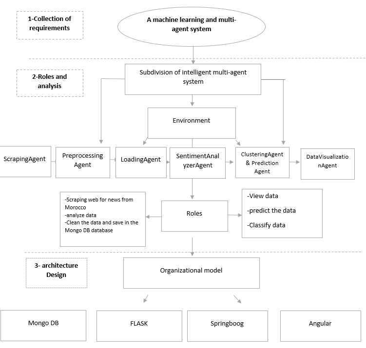

# intelligent multi-agent system based on several supervised and unsupervised machine learning algorithms
# Objectif
The main objective of the project is the realization of an intelligent multi-agent system based on several supervised and unsupervised machine learning algorithms so that the system is composed of several intelligent and interactive agents, from which each agent performs a specific task.
In addition to a Single page Application which will interact with the system in order to visualize all the tasks performed by our agents throughout the machine learning process by the different algorithms.

# Built With
Our project is based on:
- BDD : MongoDB to store the data 
- Smart Layer: Flask Framework to build APi’s. for MasLayer
- MAS Layer: Springboot Framework to build APi’s for front-end layer 
- JADE Platefrome: to implement agents and interact with the system using machine learning algorithms.
- Chart.js : JavaScript library for data visualization
- Angular: Framework for Front-end Layer

# Modelization and Architecture project 

# The steps to follow to work with 
1. Mongo db : install it from https://docs.mongodb.com/manual/installation/
Create a database name :db_covid19 and add the following collection for scraping storing data :  NewsScrapped/ Scraping_data2/ Scraping_data1
2. Smart layer: 
- Install beautiful soup for scraping script from https://pypi.org/project/beautifulsoup4/#files
- Install sklearn to use Machine learning algorithms scripts for clustering and predictiong modeling.
- Install flair modeling using pytorch to use sentiment anlysis
- Install chart.js for datavisualization from https://www.chartjs.org/docs/latest/getting-started/installation.html
3. MAS layer : Dowmload jade.jar from https://jade.tilab.com/
4. SPA Layer : Use angular's packages and 

# Authors 
BRIKA SOUMAIA 
EL KRYECH NADA [githup](NadaELKRYECH) 

